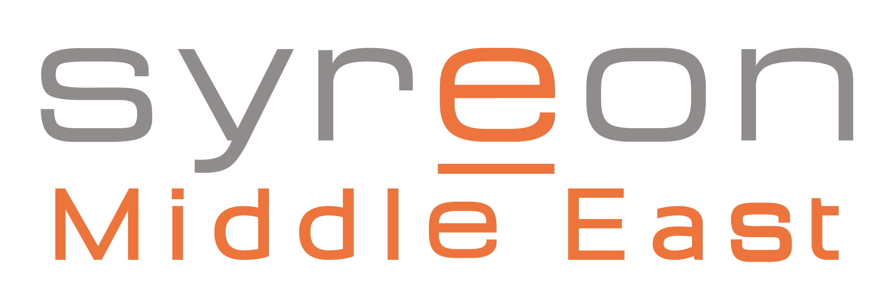
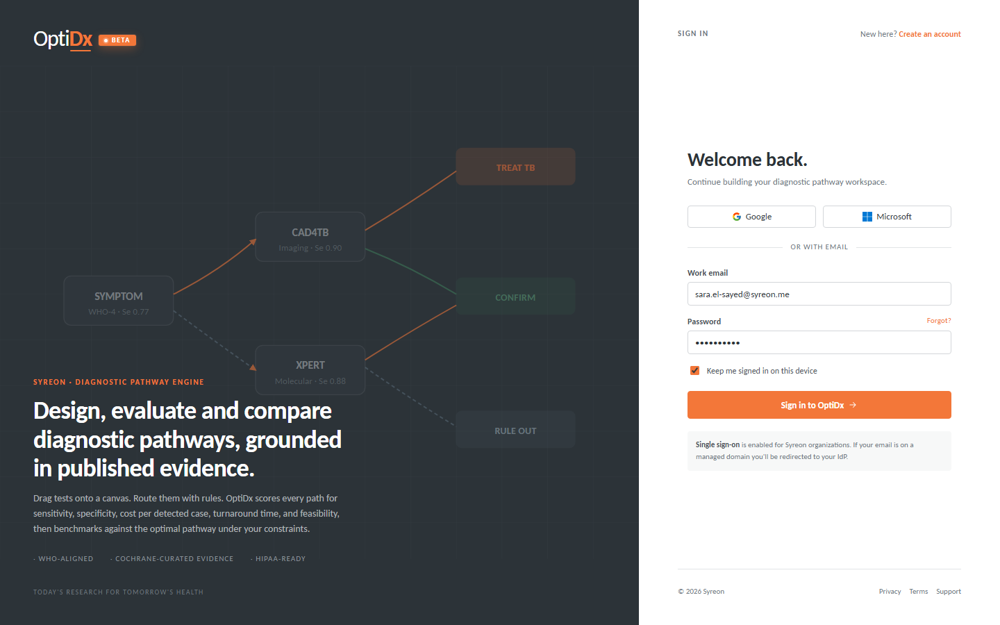
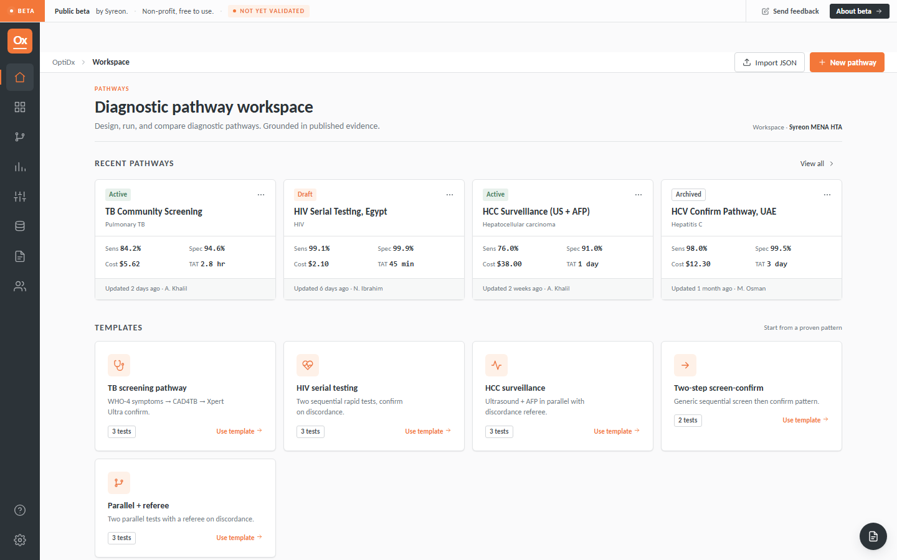
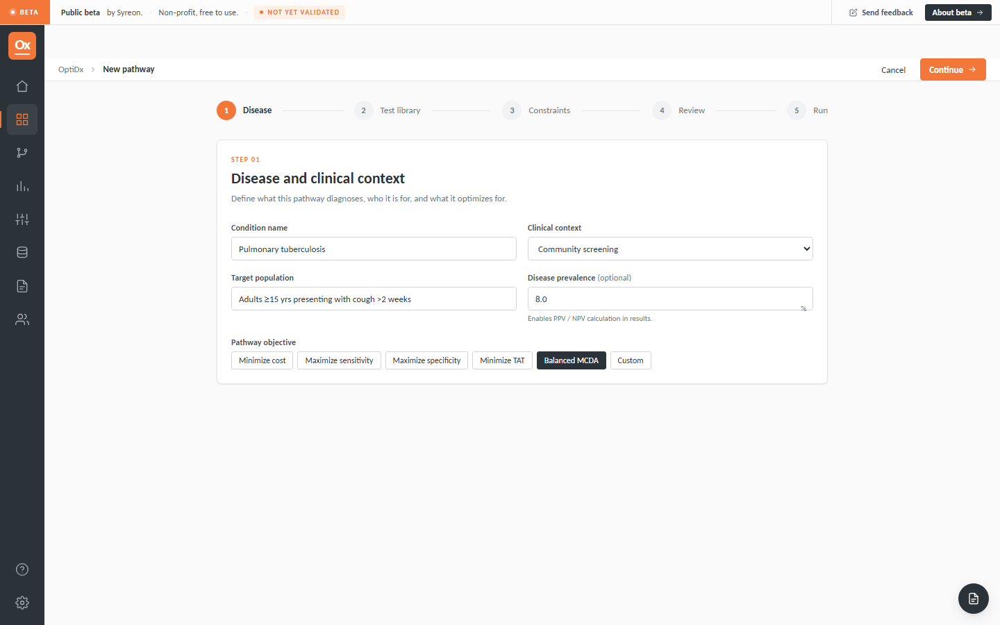
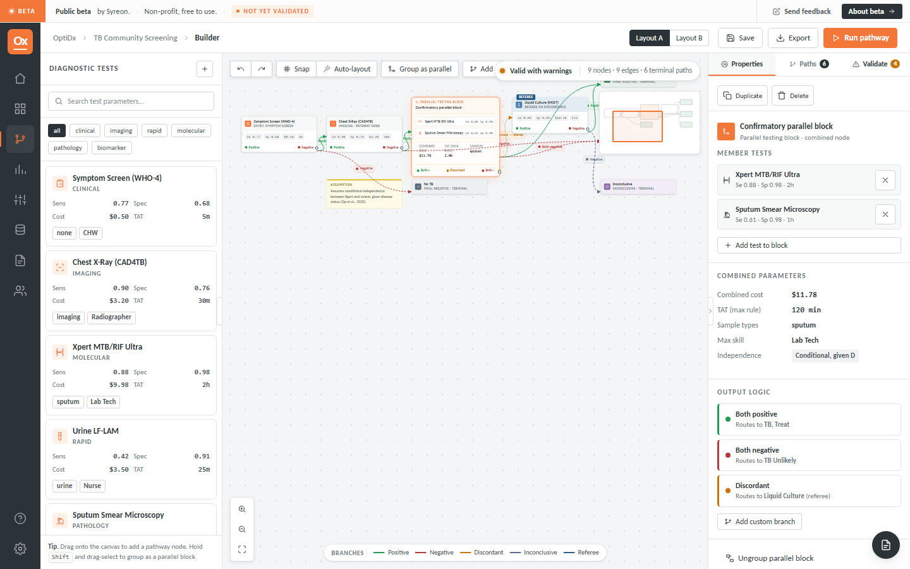
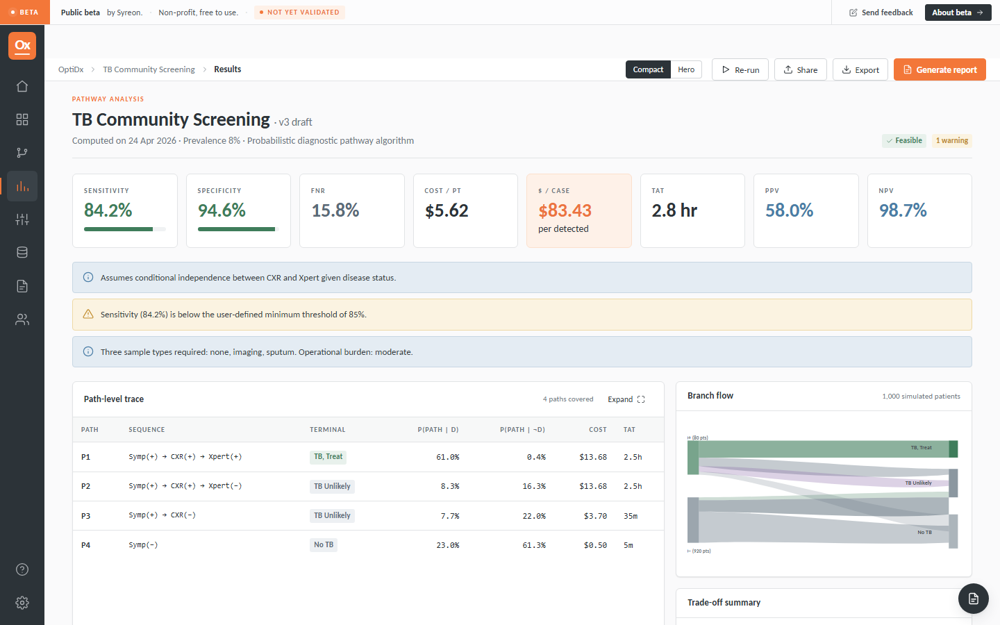

# OptiDx

<p align="center">
  
</p>

<p align="center">
  <b>Probabilistic diagnostic pathway analysis for public-good use</b><br/>
  Built by the Syreon health-economics team for ministries of health, NGOs, researchers, and HTA teams.
</p>

<p align="center">
  Live screenshots from the local web tool.
</p>

<p align="center">
  
  
  
  
  
</p>

## What OptiDx Does

OptiDx helps users design, evaluate, and optimize diagnostic pathways using transparent probabilistic methods.

- Build sequential, parallel, and branching diagnostic pathways.
- Evaluate sensitivity, specificity, PPV, NPV, false-negative rate, false-positive rate, cost, turnaround time, sample burden, and skill burden.
- Compare candidate pathways under constraints.
- Export pathway JSON, HTML reports, and later PDF/CSV outputs.
- Keep evidence and provenance attached to both tests and pathways.

## Current Stack

- Frontend: React + Vite
- Backend: Laravel 12 / PHP 8.3
- Engine: Python canonical evaluator in `optidx_package/optidx/engine.py`
- Local runtime: Laragon-friendly
- Data layer: relational database with JSON pathway payloads
- Queue/cache: Redis-ready

## Local Development

The web app lives in [`web/`](web/).

```bash
cd web
composer install
npm install
php artisan migrate
npm run build
php artisan serve
```

Open:

- `http://127.0.0.1:8000`
- `http://127.0.0.1:8000/api/health`

After signing in, the workspace home loads persisted pathways, evidence tests, and settings from the API. Pathways that have not been evaluated yet will render with placeholder summary values instead of crashing the shell.

## Validation

```bash
cd web
php artisan test
```

```bash
pytest optidx_package/tests/test_engine.py
```

## Project Structure

- `web/` Laravel app and Vite frontend
- `optidx_package/` canonical Python engine package and benchmark fixtures
- `docs/screenshots/` live screenshots captured from the running web tool
- `OptiDx UI V2/` authoritative Syreon visual language and UI reference
- `ARCHITECTURE.md` technical architecture baseline
- `FUTURE_TASKS.md` deferred work and technical debt
- `CHANGE_LOG.md` running change history

## Documentation Rule

Any meaningful change to the `web/` tool should update this README and `CHANGE_LOG.md`.

If the architecture changes, update `ARCHITECTURE.md` as well.

## License

OptiDx is intended as an open-source public good. Add the final project license here when the licensing decision is finalized.
